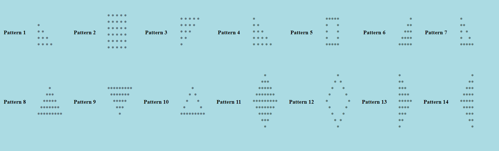

<h2> Basic Rules to print All Pattern </h2>

<ol>
<li> Run the outer FOR LOOP the number of times you are having the lines. <b>Outer FOR LOOP is for ROWS and Inner FOR LOOP is for COLUMNS.</b> </li>
<li> How many colums are there with each row => Identify for every ROW numbers how many colums are there. </li>
<li> What do you need to print? </li>
</ol>

<a href="pattern/all_patterns.php"> See Code for Different Patterns </a>

